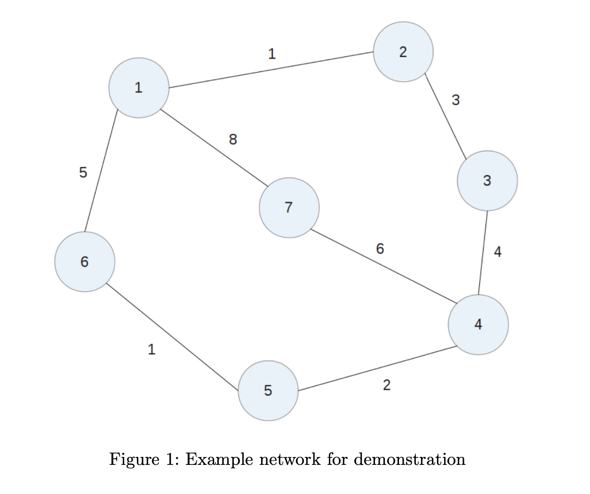

# COSC364 RIP Assignment
An implementation of parts of the RIP routing protocol, designed to run as several
instances on the same machine. Each instance runs as a separate process, and these
processes communicate through local sockets. Designed for emulation of a small network,
and exploring the response of the RIP protocol to different types of faults.

## Usage
1. Install requirements
```bash
pip3 install tabulate
```
2. Populate config files. For examples, see [/config](config).

3. Start the 'routers'. For each config file, run the below: 
```bash
python3 main.py /path/to/config.ini
```
For more detailed information on periodic / triggered update timing, and the contents of received packets, 
append the ``--verbose`` or ``-v`` flag:
```bash
python3 main.py /path/to/config.ini --verbose
```

## Example Network
The included example configuration files, ``1.ini`` through ``7.ini``, respresent the following test network: 
